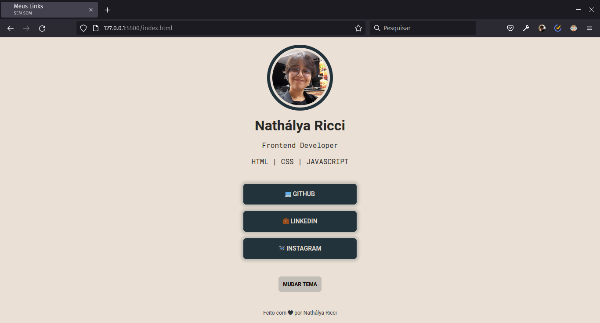
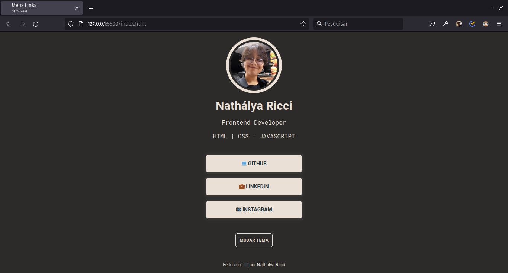

<h1 style="text-align: center">Rocketlinks</h1>

## 💻 Projeto

Desafio proposto na Maratona Explorer da Rocketseat.
 
Site para concentrar múltiplos links, com versões em modo claro e escuro implementados por mim.

## 🛠️ Tecnologias usadas

- HTML5
- CSS3
- JavaScript

## 👀 Live Preview
https://nathalya-ricci.github.io/rocketseat-rocket-links/
